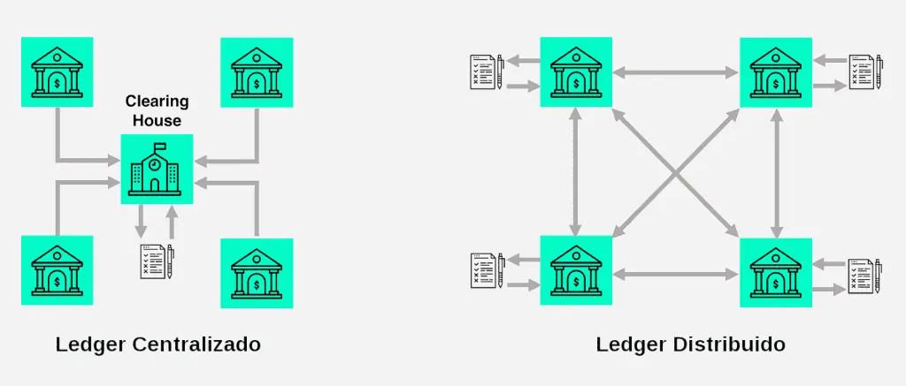

<div align="center">
  <h1> Distributed Bet - Apostas Esportivas Distribuídas </h1>
  <h3>Universidade Estadual de Feira de Santana</h3>
  <h3> TEC502 - MI Concorrência e Conectividade</h3>
  <h4>Letícia Teixeira Ribeiro dos Santos, Lucca de Almeida Hora Coutinho</h4>
</div>

## Introdução

<p align="justify">
	O progresso tecnológico tem revolucionado vários campos, incluindo o segmento de apostas online. Habitualmente, as plataformas centralizadas dominam o mercado, funcionando como intermediárias na administração de apostas e depósitos. Contudo, tais sistemas se deparam com obstáculos ligados à confiabilidade, transparência e resistência a restrições do governo.
</p>

<p align="justify">
	Nós, como um grupo de desenvolvedores independentes, tivemos a ideia de criar um sistema de apostas descentralizado que utiliza tecnologias de ledger distribuído (DLT). A meta é eliminar intermediários, ampliar a transparência e atenuar as fragilidades regulatórias, estabelecendo um ambiente seguro e de fácil acesso para os utilizadores. 
</p>

<p align="justify">
	O sistema Distributed Bet tem como objetivo principal a liberdade e confiança do usuário. O usuário é livre para criar uma aposta desejada, chamada de evento, e por outra vez, apostar em eventos criados por outros usuários. Quanto a confiabilidade, garante ao utilizador transações monetárias seguras, tanto para depósito quanto para retirada dos ganhos das apostas.
</p>

## Fundamentação Teórica

<p align="justify">
	O desenvolvimento de um sistema distribuído de apostas é uma tarefa difícil que requer uma base conceitual sólida, para que o produto final seja o mais confiável e seguro possível. Afinal, estamos lidando com pessoas, dinheiro e apostas: uma combinação de fatores que requer transparência aos usuários para evitar complicações. 
</p>

<p align="justify">
	Esta seção busca resumir os conceitos aprendidos e utilizados na criação do Distributed Bet, fundamentando o conhecimento da equipe de desenvolvimento.
</p>

### Ledger Distribuído

<p align="justify">
	Tecnologias de ledger distribuído são sistemas de registro digital descentralizados que funcionam sem a intervenção de um órgão central. Todas as transações são validadas por uma rede de nós, assegurando a inalterabilidade e a transparência. A tecnologia é notável em usos que demandam confiabilidade e resistência a censura, sendo bastante empregada em criptomoedas. 
</p>

<p align="center">
    
    <br/>
    <b>Figura 1.</b> Sistema de Ledger Centralizado x Distribuído. <b>Fonte:</b> Internet.
</p>

<p align="justify">
	Um DLT (também chamado de livro-razão distribuído) registra transações em vários locais ou participantes. Ao contrário dos Ledger's centralizados tradicionais, os DLT dependem de uma rede de nós, cada um mantendo uma cópia do livro-razão. Através de algaritmos de consenso, as transações são realizadas, sincronizadas e atualizadas em todas as cópias.
</p>

<p align="justify">
	As características principais de uma DLT são: 
</p>

- **Descentralização**: DLT's distribuem dados e controle entre vários nós, eliminando a necessidade de uma entidade central.
- **Baseado em Consenso**: mecanismos de consenso auxiliam na sincronização dos nós.
- **Imutabilidade**: quando uam transação é feita, não pode ser alterada.
- **Transparência**: os usuários da rede podem visualizar todo o histórico de transação.

<p align="justify">
	Por conta desses atributos, as DLT's são aplicadas em serviços financeiros, sistemas de criptomoedas (bitcoin, por exemplo), gestão de suprimentos, sistemas de votação e até em assistência médica (registros de saúde). 
</p>

<p align="justify">
	As DLT's normalmente são associadas a tecnologia blockchain, porém podem ser implementadas usando outras abordagens de bancos de dados distribuídos.
</p>

### Blockchain 

<p align="justify">
	Segundo a IBM Blockchain, uma blockchain é um livro-razão compartilhado e imutável que facilita o processo de registro de transações e rastreamento de ativos em uma rede de negócios. Praticamente qualquer coisa pode ser rastreada e negociada em uma rede blockchain, e no caso do Distributed Bet, são o dinheiro e as apostas.
</p>

<p align="center">
    
    <br/>
    <b>Figura 2.</b> Blockchain. <b>Fonte:</b> Internet.
</p>

<p align="justify">
	A utilização de uma blockchain é importante pois garante segurança e transparência, uma vez que os dados compartilhados e observáveis são armazenados em um livro-razão inalterável onde apenas usuários permitidos podem acessar. Além dos registros imutáveis, uma outra característica de uma blockchain são os contratos inteligentes.
</p>

#### Contratos Inteligentes

<p align="justify">
	Os contratos inteligentes são programas autoexecutáveis armazenados em blockchains que automatizam acordos entre partes. Nesse sistema, esses contratos validam as apostas conforme o saldo dos usuários, armazenam regras de distribuição de prêmios com base nas odds e permitem a criação de eventos. Resumidamente, são os contratos inteligentes que definem as condições de transações do sistema.
</p>

## Metodologia e Resultados
<p align="justify">
Entre as ferramentas utilizadas no projeto estão:

- Go Ethereum (Geth) versão 1.10.7: Um cliente de execução da rede Ethereum, desenvolvido em linguagem Go. O Geth permite executar contratos inteligentes, realizar transações e mineração de blocos, além de utilizar o algoritmo de consenso Proof of Work (PoW) proporcionando um ambiente muito próximo de uma Blockchain real. 
- Truffle: Utilizado para a compilação, teste e deploy dos contratos inteligentes, facilitando o desenvolvimento e gerenciamento dos contratos na Blockchain.
- HTML, CSS e JavaScript: Utilizados para a criação da interface do usuário e estilização
- Biblioteca Serve: Responsável por executar o servidor do dApp (Decentralized Application), permitindo que os usuários realizem operações na Blockchain.
</p>

### Conexões
<p align="justify">
 Foram implementados 3 nós na blockchain, e todos se conectam com todos através da conexão peer-to-peer. Os blocos minerados são sincronizados entre os nós a todo momento, garantindo que todos tenham os dados mais atualizados, independente de qual nó o usuário esteja conectado.
</p>

### Contas

<p align="justify">
 O sistema cria automaticamente contas com 100 ETH de saldo ao executar o arquivo genesis.json da blockchain para cada nó, ao todo são 10 contas em cada um dos 3 nós.
</p>

### Eventos

<p align="justify">
 Qualquer usuário pode criar um evento, desde que tenha saldo para pagar o gás da transação. Esse evento é exibido como uma aposta com os resultados possíveis e botões para os usuários escolherem em qual deseja apostar; o evento fica disponível até que quem criou o finalize.
</p>

### Apostas

<p align="justify">
 A transação é feita de maneira transparente, todo o histórico fica disponível para quem quiser visualizar, e os usuários só conseguem apostar em um determinado evento se tiverem saldo suficiente para tal.
</p>

### Simulação

<p align="justify">
 O contrato emite eventos em 3 situações: 
</p>

1. Nova aposta criada
2. Alguém apostou um valor 
3. Aposta finalizada

<p align="justify">
	Esses eventos também podem ser visualizados no histórico que fica disponível para todos os usuários.
</p>

### Odds

<p align="justify">
 O sistema de Odds implementado é simples e fixo. O usuário, com base na probabilidade, atribui um peso para cada agente do evento. Exemplo, se em uma partida de futebol joga Corinthians e Vasco, na criação desse evento, a odd no Corinthians seria de 1.5 enquanto a do Vasco de 2.5. O usuário supõe ou determina, nesse caso, que o Corinthians tem maior probabilidade de vitória e por isso, sua odd é inferior a do Vasco. Há caso de adição de uma odd para o empate também.
</p>

### Contabilidade

<p align="justify">
 [A conferir].
</p>

### Publicação

<p align="justify">
 O histórico de todos os eventos emitidos ficam disponíveis para visualização de qualquer usuário. Detalhes importantes são registrados em cada mensagem, como a conta utilizada para apostar, valor da aposta e até endereço do contrato.
</p>

### Execução do Ambiente
<p align="justify">
 Para executar a blockchain e o dApp localmente, deve-se seguir o seguinte passo-a-passo:
</p>

- Instalar o Geth na versão 1.10.7
- Instalar dependências
```
npm install
```
- Executar os 3 nós
```
 geth --http --http.corsdomain="*" --http.api web3,eth,debug,personal,net --vmdebug --datadir ./data --port 30303 --http.port 8545 --nodiscover --allow-insecure-unlock --networkid=1337 --nat extip:127.0.0.1 console
 
  geth --http --http.corsdomain="*" --http.api web3,eth,debug,personal,net --vmdebug --datadir ./data2 --port 30304 --http.port 8546 -nodiscover --allow-insecure-unlock --networkid=1337 --nat extip:127.0.0.1 console
  
   geth --http --http.corsdomain="*" --http.api web3,eth,debug,personal,net --vmdebug --datadir ./data3 --port 30305 --http.port 8547 --nodiscover --allow-insecure-unlock --networkid=1337 --nat extip:127.0.0.1 console
```

- Executar esse comando no console do 1º e 2º nó e copiar os endereços
```
 admin.nodeInfo.enode
```
- Executar esse comando no console do 2º nó utilizando o endereço do 1º e no 3º nó utilizando o endereço do 1º e 2º, isso permitirá conexões p2p entre todos os nós
```
 admin.addPeer("endereco_do_comando_anterior") 
```
- Iniciar a mineração de blocos, que permite realizar transações na blockchain. Pode ser executado em apenas um nó
```
miner.start()
```
- Executar o servidor do dApp e abrí-lo em localhost:3000, isso permitirá visualizar a interface do usuário e desbloquear as contas habilitando a execução de transações
```
npx serve
```
- Fazer deploy do contrato inteligente na blockchain
```
truffle migrate --network geth 
```

Após executar os passos, é possível utilizar o dApp para criar e apostar em eventos.

## Conclusão

<p align="justify">
	O sistema de apostas distribuído apresentou-se como uma solução promissora para eliminar intermediários, garantir transparência das transações aos usuários e impedir as intervenções do governo. A utilização de tecnologias de ledger distribuído, blockchain e contratos inteligentes mostrou-se eficaz na automação e na segurança das operações. 
</p>

<p align="justify">
	A proposta do problema estimulou o estudo da equipe, que mal tinha conhecimento prévio dos assuntos necessários para o desenvolvimento do sistema. Dessa forma, foi benéfico para o aprendizado, apesar de não obter total êxito no produto final.
</p>


